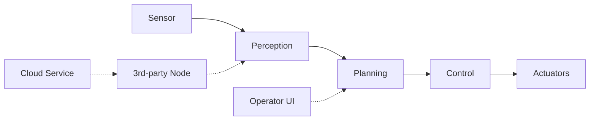
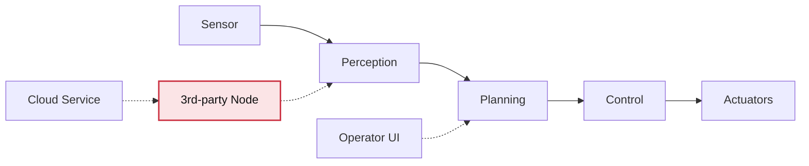

# Securing Robotics in Practice
## Developer Workflows, Architecture, and the ROS2 Ecosystem

Patrick Robinson  
patrick2.robinson@live.uwe.ac.uk

A short talk on security, architecture, and real-world robotics practice

---
transition: slide-left
layout: default
---

# Why this matters

Robotics systems are increasingly deployed in real-world environments

where failures are not just software bugs, but can have  
physical and safety-critical consequences.

Security here affects safety, reliability, and trust — across research, industry, and commercial systems with very different constraints.

---
transition: slide-left
layout: default
---

# The core claim

In robotics, security is often shaped not just by bugs in code,
but by how systems are assembled.

<h3 class="pb-2">Workflows</h3>
<ul>
<li>rapid integration</li>
<li>toolchain churn</li>
<li>time constraints</li>
</ul>

<h3 class="pb-2">Architecture</h3>
<ul>
<li>distributed nodes</li>
<li>heterogeneous components</li>
<li>networked communication</li>
</ul>

<h3 class="pb-2">Context</h3>
<ul>
<li>research vs industry</li>
<li>different risk tolerances</li>
<li>different constraints</li>
</ul>

---
transition: slide-left
---

# A typical robotics system

Even in a simplified setup:

- sensors → perception → planning → control
- additional components added over time
- operator interfaces and external services
- communication via ROS2 / DDS

Already distributed, heterogeneous, and interconnected.

---
transition: slide-left
layout: default
---

# A typical robotics system

Multiple components, interacting across a distributed system

---
transition: slide-left
layout: default
---

# Where does security actually live?

• What assumptions are trusted?  

Not in one place - across the system

---
transition: slide-left
layout: default
---

# Why ROS2?

ROS2 has become a major ecosystem for robotics development.

It is designed around:

- modularity  
- composability  
- distributed communication  
- rapid integration and prototyping  

A useful lens for studying how security is actually produced in practice

---
transition: slide-left
layout: default
---

# The research gap

We still have only a limited understanding of how developers across different domains and contexts approach security in practice.

Different settings

- research labs, startups, industrial systems 

involve different constraints, priorities, and risk practices.

---
transition: slide-left
layout: default
layoutClass: gap-12
---

# What I’m doing

### Empirical work
- surveys
- semi-structured interviews
- across research, commercial, and industrial contexts

### Focus
- workflows and tools  
- architectural decisions  
- how security is actually handled in practice  

Understanding how security is shaped by real-world constraints and decisions

---
transition: slide-left
layout: default
---

# Why this approach

Secure systems emerge from the interaction between

architecture, tools, constraints, and developer judgement

not just technical controls in isolation

If we ignore practice, we risk:

<ul class="pt-3 text-xl leading-relaxed">
  <li>barriers to adoption</li>
  <li>misalignment with real workflows</li>
</ul>

---
transition: slide-left
layout: default
---

# Closing

If we want to improve security in robotics,

we need to understand not only the technology

but the practices through which systems are built

Early-stage work, feedback and conversations very welcome

---
transition: slide-left
layout: center
class: text-center
---

# Thank you

I would love to hear from people who build or deploy robotics systems.

Especially if you have experience with:

security · integration · architecture · ROS2 workflows

patrick2.robinson@live.uwe.ac.uk

