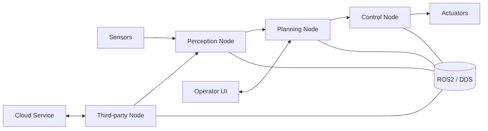
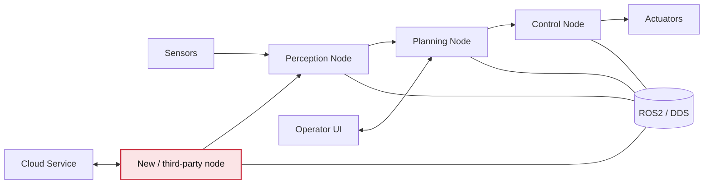
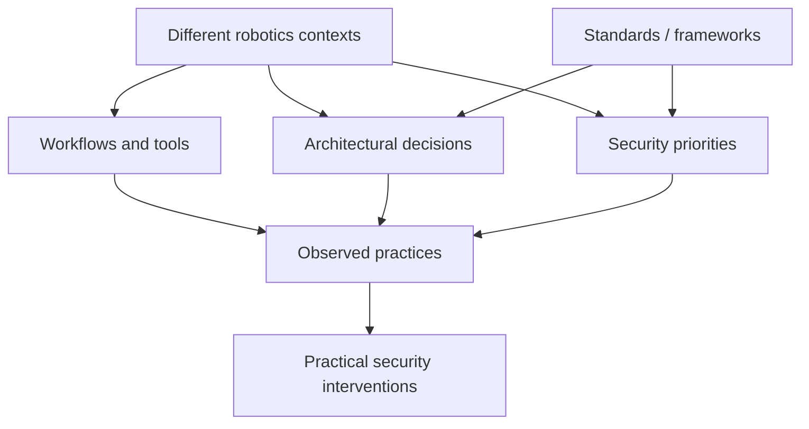

# Securing Robotics in Practice
## Developer Workflows, Architecture, and the ROS2 Ecosystem

Patrick Robinson  
patrick2.robinson@live.uwe.ac.uk

A short talk on security, architecture, and real-world robotics practice

<!--
Open simply.

Suggested opening:
"As robotics systems move into real-world deployment, ensuring their security becomes increasingly important. But in practice, securing robotics systems is surprisingly difficult."
-->

---
transition: slide-left
layout: center
---

# The core claim

In robotics, security is often shaped not just by bugs in code,
but by how systems are assembled.

<h3 class="pb-2">Workflows</h3>
<ul>
<li>rapid integration</li>
<li>toolchain churn</li>
<li>time and resource constraints</li>
</ul>

<h3 class="pb-2">Architecture</h3>
<ul>
<li>distributed nodes</li>
<li>heterogeneous components</li>
<li>networked communication</li>
</ul>

<h3 class="pb-2">Context</h3>
<ul>
<li>research vs industry</li>
<li>different risk tolerances</li>
<li>different compliance pressures</li>
</ul>

<!--
This slide states the argument plainly.
Do not over-explain yet.
End with: "So the question is not just whether a component is secure, but how security is produced across the system."
-->

---
transition: slide-left
---

# A typical robotics system

This is a deliberately simplified example, but it captures the shape of many modern robotics systems:

- sensors, perception, planning, control
- extra components added over time
- operator and cloud-facing interfaces
- communication over ROS2 / DDS

Even a "normal" setup is already distributed, heterogeneous, and interconnected.

<!--
Walk left to right.

Suggested script:
"You have sensors feeding perception, then planning, then control, which ultimately drives behaviour. But these systems are not self-contained. They often include third-party nodes, operator interfaces, and external services, all connected through middleware like ROS2 using DDS."
-->

---
transition: none
---
# A typical robotics system

 - 

---
transition: slide-up
---
# A typical robotics system

Even a "normal" setup is already distributed, heterogeneous, and interconnected.

---
transition: slide-left
layout: two-cols
layoutClass: gap-10
---

# Where does security actually live?

Imagine a new component is added quickly:

- open-source package
- vendor-supplied module
- code from another internal team

The system may still work — but security questions now sit across configuration, middleware, trust assumptions, and interfaces between components.

Not in one place — across the system.

::right::

<ul>
<li>Who can publish data?</li>
<li>What assumptions are trusted?</li>
<li>What happens when behaviour changes?</li>
</ul>

<!--
Suggested script:
"Now imagine we integrate a new component quickly to meet a deadline. The robot still works. But who authenticates that node? What assumptions does it make about the network? What happens if it publishes unexpected data? At that point, security is not located in one file or one bug. It is distributed across the way the system has been assembled."
-->

---
transition: slide-left
layout: two-cols
layoutClass: gap-12
---

# So what is the research?

I am studying how security is approached in practice across diverse robotics contexts.

### Empirical strand
- surveys
- semi-structured interviews
- sampling across research, commercial, and industrial settings

### Analytical strand
- how standards and frameworks define system boundaries
- what counts as a "robotic system"
- how those assumptions shape security thinking

::right::

The aim is not a single universal account, but a better map of how security is produced under different conditions.

<!--
This is where you briefly acknowledge diversity and instability without becoming too philosophical.
If needed say: "Part of the work is also about how these systems are framed and categorised in the first place, because those categories affect who we recruit, what we ask, and what counts as security-relevant." 
-->

---
transition: slide-left
layout: center
---

# Why this matters

<h3 class="pb-2">For research</h3>
<ul>
<li>moves beyond isolated vulnerabilities</li>
<li>connects security to architecture and practice</li>
<li>helps map a fragmented space</li>
</ul>

<h3 class="pb-2">For practitioners</h3>
<ul>
<li>surfaces real friction points</li>
<li>fits security to existing workflows</li>
<li>avoids unrealistic assumptions</li>
</ul>

<h3 class="pb-2">For robotics</h3>
<ul>
<li>supports safer deployment</li>
<li>better design-stage reasoning</li>
<li>more robust system integration</li>
</ul>

If we want secure robots in the real world, we need to understand how security is actually made in the systems people build.

<!--
Slow down here. This is the payoff slide.
-->

---
transition: slide-left
layout: center
class: text-center
---

# Thank you

I would love to hear from people who build or deploy robotics systems.

Especially if you have experience with:

security · integration · architecture · ROS2 workflows

patrick2.robinson@live.uwe.ac.uk

<!--
Possible close:
"At this stage, I am especially interested in speaking to people who have run into security, integration, or architectural challenges in practice."
-->

